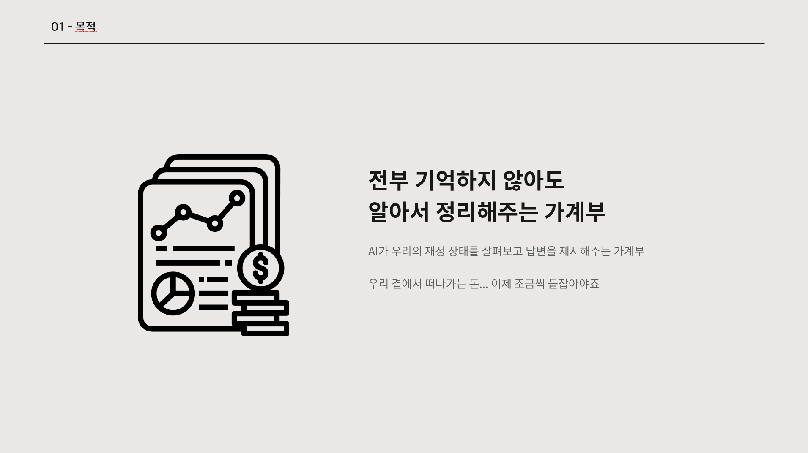
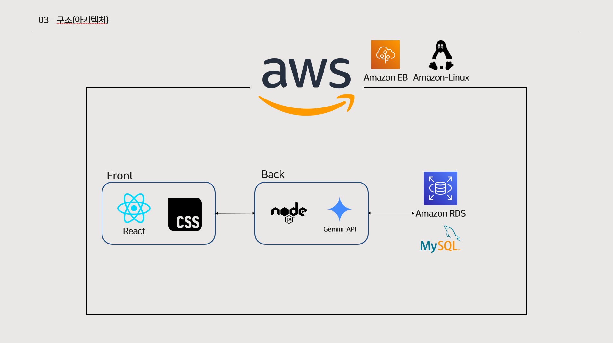
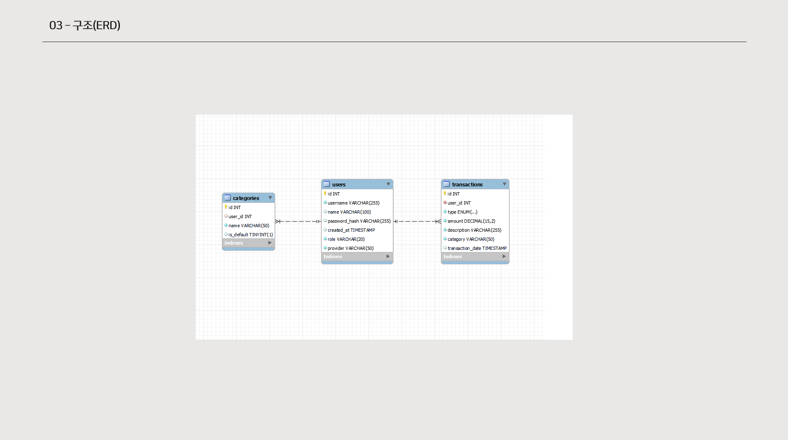
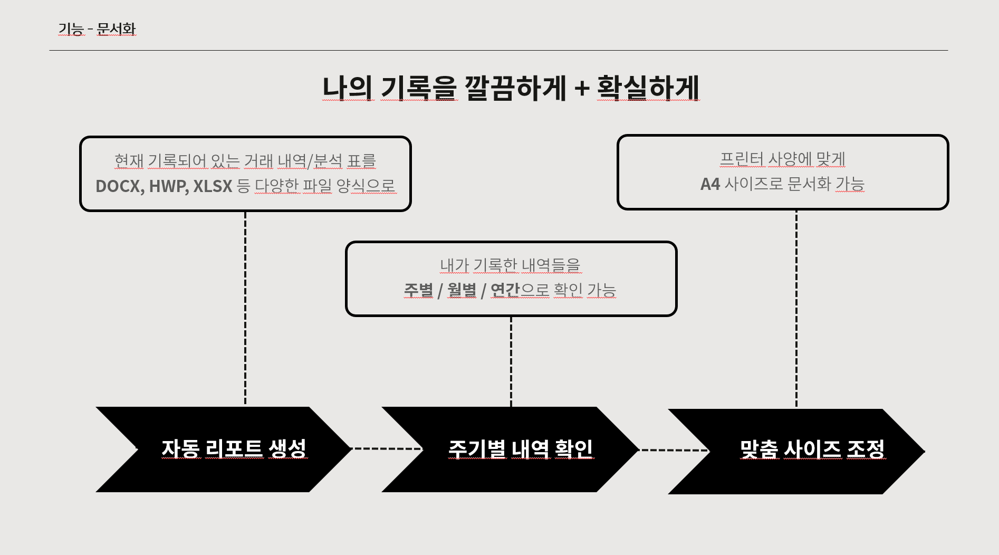
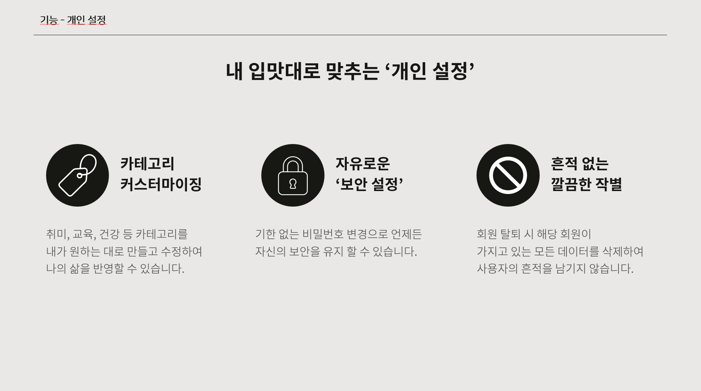
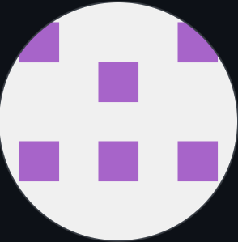
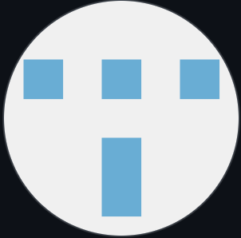
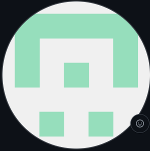

# Team_Unnamed

 
  

## 프로젝트 개요

 

## 개발 환경

  <h4 style="margin: 0;">프론트엔드</h4>
  
  

  <h4 style="margin: 0;">백엔드</h4>
  
  
  
  

  <h4 style="margin: 0;">배포</h4>
  

  <h4 style="margin: 0;">협업툴</h4>
  
  
  

  <h4 style="margin: 0;">디자인</h4>
  

## 시스템 구성도

  

## ERD

 

## 주요 기능

   
   
 

## 시연 동영상

<a href="https://youtu.be/zG9_g3QvObo">영상 링크</a>
 

## 🧑‍🎨 팀원 

| **조성훈** | **이문규** | **신승완** |
|---|---|---|
|  |  |  |
| (팀장)프론트엔드, 백엔드 | 프론트엔드, 백엔드 | 백엔드 |
